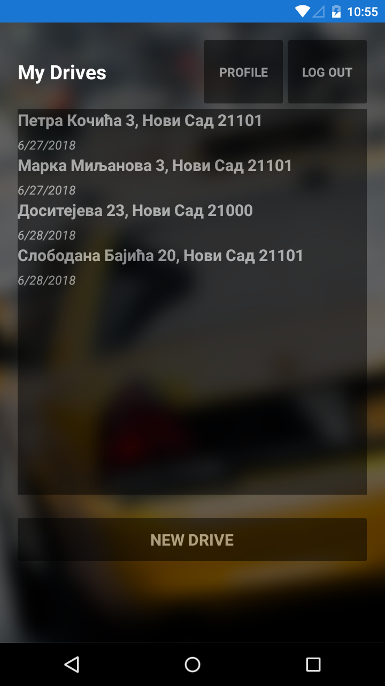

# TaxiXamarinApp

A project in Xamarin which allows you to register user, login, create new drive, get all drives, comment them and update user profile from the endpoints of the API. This project use Xamarin.Forms.

## Xamarin.Forms

Xamarin.Forms provides a way to quickly build native apps for iOS, Android, Windows and macOS, completely in C#.
Read more about the platform at https://www.xamarin.com/forms.

## Platforms
Android, iOS & UWP.

  
  
  

  
  
  

